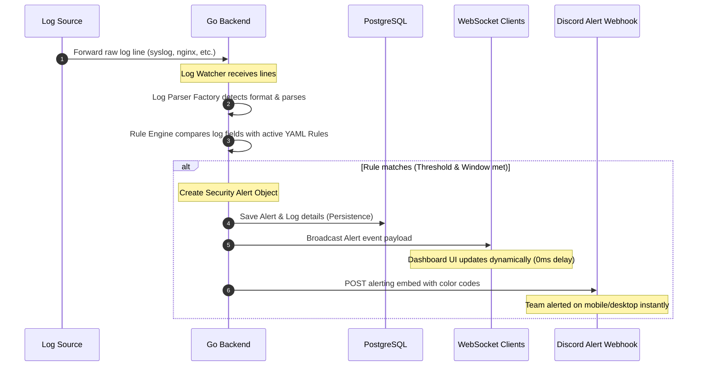
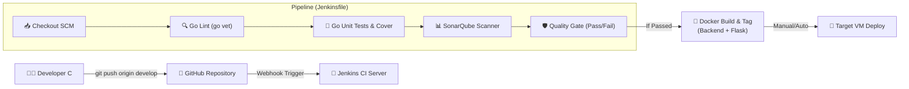

# 📊 PUSINGBERAT SIEM — Architecture & Slide Deck Guide

This document contains **production-ready architecture diagrams** (using Mermaid format) and a **compelling Slide Deck Outline** for your Day 11 presentation.

---

## 🏗️ 1. Technical Architecture Diagrams

You can render these diagrams directly in Markdown viewers (GitHub, VS Code, etc.) or export them to PNG/SVG using Mermaid Live Editor.

### 🔹 Core System Architecture
Shows how Nginx manages incoming traffic at Port 80, routing API calls to Go, WebSockets, and HTML views to Flask.

```mermaid
graph TD
    %% Styling
    classDef client fill:#3b82f6,stroke:#1d4ed8,stroke-width:2px,color:#fff;
    classDef edgeProxy fill:#10b981,stroke:#047857,stroke-width:2px,color:#fff;
    classDef service fill:#8b5cf6,stroke:#6d28d9,stroke-width:2px,color:#fff;
    classDef db fill:#f59e0b,stroke:#b45309,stroke-width:2px,color:#fff;

    %% Nodes
    User(("🌐 Security Analyst<br>(Web Browser)")):::client
    SyslogSender["💻 Server / VM<br>(Sends Syslog / Nginx logs)"]:::client
    
    subgraph VM ["☁️ Cloud VM (108.136.60.238)"]
        Nginx["🛡️ Nginx Reverse Proxy<br>(Port 80)"]:::edgeProxy
        
        subgraph Docker ["🐳 Docker Compose Stack"]
            Flask["🐍 Flask SPA Server<br>(Port 5000)"]:::service
            GoBackend["🐹 Go Gin Backend<br>(Port 8080)"]:::service
            Postgres[("🐘 PostgreSQL DB<br>(Port 5432)")]:::db
        end
    end
    
    Discord["💬 Discord Channel<br>(Alert Notifications)"]:::client

    %% Connections
    User -->|HTTP Requests| Nginx
    SyslogSender -->|Forward Logs| GoBackend
    
    Nginx -->|/* (Serve Vue SPA pages)| Flask
    Nginx -->|/api/v1/* (REST API)| GoBackend
    Nginx -->|/ws (Real-Time WS Alert Feed)| GoBackend
    
    GoBackend -->|Read/Write Data| Postgres
    GoBackend -->|Webhook Alert| Discord
    
    class Nginx,Flask,GoBackend,Postgres service;
```

---

### 🔹 Log Collection & Rule Matching Pipeline
Detailed view of how a log line becomes an instant security incident in the dashboard and on Discord.



---

### 🔹 Continuous Integration & Deployment (CI/CD)
The automated pipeline orchestrating your Jenkins server and SonarQube quality gate.



---

## 🗂️ 2. Slide Deck Outline (10 Slides)

Here is a highly professional, ready-to-use slide structure for your Day 11 demo day presentation.

### Slide 1: Cover Slide
*   **Title**: PUSINGBERAT SIEM: Real-Time Log Auditing & Threat Detection Platform
*   **Subtitle**: A Modern, Scalable, and Production-Ready Security Incident & Event Management System
*   **Presenter Info**: Team Developer C / Development & Operations
*   **Visual Suggestion**: Dark background, neon-blue text, minimalist security shield icon.

### Slide 2: The Problem
*   **Key Points**:
    *   Siloed logs across multiple microservices make tracing attacks nearly impossible.
    *   Slow, batch-based log ingestion fails to prevent active security incidents (e.g., brute-force attacks).
    *   Lack of centralized alerting means teams only discover breaches hours or days too late.
*   **Visual Suggestion**: Red/gray text highlighting industry statistics on breach detection times.

### Slide 3: The Solution
*   **Key Points**:
    *   **PUSINGBERAT SIEM**: An lightweight, ultra-fast log parsing and rule-matching SIEM.
    *   **Real-Time Processing**: Watcher pipelines that process logs as they happen.
    *   **Instant Notifications**: Active real-time WebSocket feeds and Discord integration with retry mechanisms.
*   **Visual Suggestion**: Parallel boxes showing: Ingest ➔ Analyze ➔ Notify.

### Slide 4: System Architecture
*   **Key Points**:
    *   **Nginx Reverse Proxy**: Acting as a single exposed entry point (Port 80) for robust security.
    *   **Flask SPA Server**: Lightweight server serving a responsive and highly-interactive Vue 3 frontend.
    *   **Go/Gin Core Backend**: Multi-threaded parsing pipeline utilizing robust Go Goroutines.
    *   **PostgreSQL**: High-performance persistence layer with indexing on critical telemetry columns.
*   **Visual Suggestion**: Embed the *Core System Architecture* diagram here.

### Slide 5: The Log Parsing & Rule Engine (Core Engine)
*   **Key Points**:
    *   **Factory Pattern Parsers**: Modular design supporting Syslog, Nginx access logs, and generic log files.
    *   **YAML Rule Engine**: Declarative custom detection rules (e.g., matching 5 failed logins within 60 seconds).
    *   **Fail-Safe Delivery**: Discord notifier featuring backoff retry logic to prevent notification loss.
*   **Visual Suggestion**: A side-by-side view showing a raw log line, its matching YAML rule, and the resulting JSON alert payload.

### Slide 6: CI/CD Pipeline & Quality Gate
*   **Key Points**:
    *   **Automated Verification**: Run linting (`go vet`) and test coverage profiles on every single commit.
    *   **SonarQube Quality Gate**: Strictly enforcing high code quality (Reliability A, Security A, Coverage ≥ 50%).
    *   **Docker Invariance**: Automatic multi-stage builds ensuring identical environments from dev to production.
*   **Visual Suggestion**: Screenshot of your green SonarQube dashboard showing the "Passed" quality gate status.

### Slide 7: Production Hardening & Operations
*   **Key Points**:
    *   **Rate Limiting**: Nginx rate-limiting zones limiting REST API abusers to 30 requests/minute.
    *   **State Recovery**: Container restart policies ensuring uptime across server reboots.
    *   **Data Protection**: Auto-compressed nightly database backup and rotation script (7-day retention).
*   **Visual Suggestion**: Terminal snippets showing the backup execution and Nginx active rate limiting log lines.

### Slide 8: Live Technical Demo Walkthrough
*   **Steps to Demonstrate**:
    1.  Show empty/clean dashboard metrics.
    2.  Ingest SSH brute-force attack logs.
    3.  Observe the metrics, severity charts, and alert lists updating **instantly (in 0ms)** over WebSocket.
    4.  Verify the Discord channel receives the critical incident card.
    5.  Acknowledge the alert on the UI and witness the state resolve across the platform.

### Slide 9: Tech Stack Summary
*   **Backend**: Go (Gin, `pgx/v5`)
*   **Frontend**: Vue 3, PrimeVue UI, Chart.js
*   **DevOps/Infra**: Nginx, Docker, Jenkins CI, SonarQube, PostgreSQL 16
*   **Alerts**: Discord Webhooks, WebSockets

### Slide 10: Thank You & Q&A
*   **Call to action**: "Empowering security teams with real-time log intelligence."
*   **Contact/Links**: Team GitHub Repository & VM Live IP.
